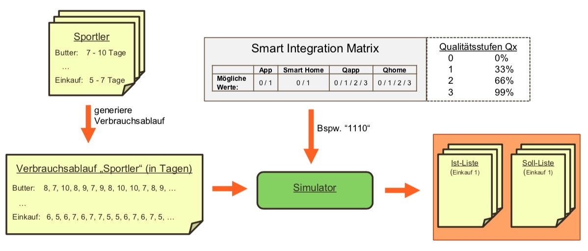

# Simulation und Auswertung

## Definitionen

Im folgenden werden die in der Simulation verwendeten Hilfsmittel und Bausteine dargestellt, um die Aussagekraft der Simulation und derer Ergebnisse zu veranschaulichen. Die folgenden Definitionen sind Teil der durchgeführten Simulation und bieten die Grundlage zum Verständnis der nachfolgenden Simulationsdokumentation.

### Bewertungskriterien

Bevor wir mit der Simulation begannen, definierten wir zuerst die der Simulation zu Grunde gelegten Bewertungskriterien. Bewertet werden soll allgemein gesagt die Nützlichkeit der vorgestellten Applikationen im Bezug auf den Einkaufsprozess.  
Da unsere Applikation\(en\) den Einkaufsprozess anhand einer digitalen Einkaufsliste verbessern, liegt der Fokus auf der Korrektheit der automatisch generierten Einkaufsliste. D.h. uns interessiert das sogenannte Delta zwischen der automatisch generierten Einkaufsliste \(Ist-Liste\) und der optimales Einkaufliste \(Soll-Liste\) um die Korrektheit der Liste überhaupt bewerten zu können.  
Um die Korrektheit zwischen den zwei Listen einheitlich zu messen, haben wir folgende Metriken festgelegt:

* Anzahl der Produkte auf Soll-Liste, die auf der Ist-Liste fehlen
* Anzahl der Produkte auf Ist-Liste, die nicht auf Soll-Liste stehen

### Persona

Entspricht in diesem Zusammenhang bestimmten Konsum- & Verbrauchsdaten über eine bestimmte Person oder einen Personenkreis. Eine Persona definiert sich dabei durch eine Menge von Produkten die regelmäßig \(oder auch unregelmäßig\) gekauft werden, mit zusätzlicher Angabe des durchschnittlichen Verbrauchs in Form von Intervallen. Zusätzlich zu den Verbrauchs-/Bedarfsinformationen wird eine Einkaufshäufigkeit in Form eines Intervalls angegeben. D.h. zusammengefasst ist für bestimmte Produkte deren Bedarfshäufigkeit in einer Persona definiert, sowie auch dessen allgemeint Einkaufshäufigkeit \(in gleicher Form\).

Die folgende Tabelle veranschaulicht dies am Beispiel einer Sportler-Persona:

| Produkt | Bedarfshäufigkeit \(Sportler\) |
| :--- | :---: |
| Butter | 25 - 30 Tage |
| Milch |  7 - 14 Tage |
| Käse | 10 - 15 Tage |
| Salami |  7 - 10 Tage |

| Einkaufshäufigkeit \(Sportler\) | 7 - 14 Tage |
| :--- | :--- |


### Smart Integration Matrix


Die Smart Integration Matrix zeigt die in unserem Szenario möglichen Varianten wie eine Einkaufsliste befüllt werden kann. Dabei sind für die zwei definierten Möglichkeiten \('Manuell', 'Smart Home'\) jeweils Qualitätsstufen angegeben, welche das Maß der Qualität der Nutzung der zwei Verwaltungsmöglichkeiten darstellt. Diese Qualitätsstufen können Werte zwischen 0 und 3 annehmen, wobei eine '0' bedeute, dass diese Komponente nicht verwendet wird und eine '3' einer sehr sorgfältigen Verwendung entspricht.

Die Tabelle der möglichen Werte ist im Folgenden dargestellt: 

|  | **App** |    | **Smart Home** | **Qapp** | **Qhome** |
| :--- | :--- | :--- | :--- | :--- | :--- |
| Mögliche Werte: | 0 / 1 |    | 0 / 1 | 0 / 1 / 2 / 3 | 0 / 1 / 2 / 3 |

Die möglichen Werte \(0 / 1\) in Spalte App und Smart Home geben an, ob die Komponente verwendet wird. Die in Spalten Qapp und Qhome angegebenen Qualitätsmaße geben an, wie gut die bestimmte Komponente verwendet wird. Die Quaitätsstufen sind vordefinierten Aufnahme-Wahrscheinlichkeiten zugeordnet. Diese Aufnahme-Wahrscheinlichkeit gibt an, mit welcher Wahrscheinlichkeit ein Produkt zum Zeitpunkt des Verbrauchs oder des Ablaufs durch die entsprechende Komponente vom Nutzer in die Einkaufsliste aufgenommen wird.  
Dieser Zuordnung ist in folgender Tabelle dargestellt:

| Qualitätsstufe | Beschreibung | Aufnahme-Wahrscheinlichkeit |
| :--- | :--- | :--- |
| 0 | keine Verwendung | 0% |
| 1 | gelegentliche Verwendung | 33% |
| 2 | mittelmäßige Verwendung | 66% |
| 3 | sorgfältige Verwendung | 99% |

In der Simulation verwenden wir diese Matrix, um verschiedenste Verhaltensweisen bezüglich der Pflege des Einkaufszettels der Nutzer nachstellen zu können. Anhand der Simulation kann anschließend der Nutzen unserer Anwendungen für die verschiedensten Verhaltensweisen gemessen werden. Auf Basis dieser Simulation können zudem geeignete Nutzungsstrategien der vorhandenen Technologien empfohlen werden, um die Präzision des Zettels zu verschärfen.

## Simulationsaufbau

Die folgende Abbildung fasst den Simulationsaufbau zusammen.



Für die Simulation wurden die folgenden Schritte durchgeführt:

* **Erstellung einer Persona** Beispielsweise ein Sportler der Butter innerhalb von 17 bis 22 Tagen verbraucht hat und alle 5 bis 7 Tage einkaufen geht. Im folgenden Codeblock ist eine beispielhafte Definition einer Persona in unserer Applikation dargestellt.

```text
// Persona Definition: Beispiel Sportler
Map<String, Produkt> sportlerProduktMap = new HashMap<String, Produkt>();

public void setSportlerProduktMap() {
	sportlerProduktMap.put("Butter", new Produkt("Butter", 17, 22));
	sportlerProduktMap.put("Milch", new Produkt("Milch", 3, 7));
	sportlerProduktMap.put("Kaese", new Produkt("Kaese", 7, 10));
	sportlerProduktMap.put("Salami", new Produkt("Salami", 5, 7));
	sportlerProduktMap.put("Joghurt", new Produkt("Joghurt", 20, 25));
}
```

* **Erstellung vom Verbrauchsablauf** Auf Basis der vordefinierten Personadaten wird ein Verbrauchs- sowie Einkaufsablauf erzeugt, aus welchem sich eine ideale Einkaufsliste \(Soll-Liste\) für die Persona ableiten lässt. Diese ideale Einkaufsliste wird als csv-Datei für die weitere Verarbeitung bzw. Auswertung abgelegt. Im folgenden Codeblock wird die ideale Liste dargestellt. Dabei entspricht die erste Spalte Zahlen dem Einkaufsablauf und die darauf folgende Liste den benötigten Produkten zum Zeitpunkt dieses Einkaufs.



```text
---------------------------
-----Soll-Einkaufsliste-----
---------------------------
4;Milch;
7;Milch;Kaese;Salami;
13;Milch;Salami;
17;Butter;Milch;Kaese;
20;Salami;Joghurt;
25;Milch;Salami;
28;Kaese;
32;Milch;Salami;
...
```



* **Abbildung der Smart Integration Matrix** Die festgelegten Matrix-Werte werden dem Simulator als Parameter übergeben 
* **Simulation** Die Simulation erfolgt, indem die Methode _simuliereAblauf\(\)_ aufgerufen wird. Diese Methode bildet den Simulator ab und nimmt  neben den Matrix-Werten eine bestimmte Persona, ihre ideale Liste und den Zeitraum über den die Simulation ablaufen darf als Parameter.

```text
public void simuliereAblauf(Persona persona, Map<Integer, \
	List<Produkt>> sollEinkaufsListenMap, int zeitRaum, boolean appTouchPoint,
	boolean homeTouchPoint, int Qapp, int Qhome, String matrixCombinationDateiName) throws ParseException {
	
	Map<Integer, List<String>> istEinkaufsListeMap = new HashMap<>();
	List<Integer> sollEinkaufsListenMapKeys = sollService.sortiereSollMapKey(sollEinkaufsListenMap);
	
	for(int i=1; i<=zeitRaum; i++) {
		// Sollliste für Tag i erstellen
		List<Produkt> sollListeTagI= sollService.erstelleSollEinkaufsListe(persona, i);
		
		// hole generierte Einkaufsliste (von der App)
		einkaufslistenGenerator.get_berechneteEinkaufsliste(1, i);
		
		// setze ggf. verbrauchte Produkte auf die istEinkaufsliste
		List<String> istEinkaufsliste = istService.get_einkaufsliste(1);
		
		double pApp = 0.0;
		switch (Qapp) {
		case 1:
			pApp=0.33;
			break;	
		case 2:
			pApp=0.66;
			break;
		case 3:
			pApp=0.99;
			break;
		default:
			appTouchPoint=false;
			break;
		}
		
		double pHome = 0.0;
		switch (Qhome) {
		case 1:
			pHome=0.33;
			break;
		case 2:
			pHome=0.66;
			break;
		case 3:
			pHome=0.99;
			break;
		default:
			homeTouchPoint=false;
			break;
		}
		
		for(Produkt produkt : sollListeTagI) {
			if(einkaufslistenGenerator.itemAlreadyExist(istEinkaufsliste, produkt.getName())==false) {
				if (appTouchPoint && Math.random() <= pApp) {
					istService.put_Product_On_Einkaufsliste(1, produkt.getName(), i);
					istEinkaufsliste = istService.get_einkaufsliste(1);
				}
			}if(einkaufslistenGenerator.itemAlreadyExist(istEinkaufsliste, produkt.getName())==false) {
			
				if (homeTouchPoint && Math.random() <= pHome) {
					istService.put_Product_On_Einkaufsliste(1, produkt.getName(), i);
					istEinkaufsliste = istService.get_einkaufsliste(1);
				}
			}
		}
		istEinkaufsliste = istService.get_einkaufsliste(1);
		
		// Überprüfen, ob Tag i Einkaufstag ist
		if(sollEinkaufsListenMapKeys.contains(i)) {
			istEinkaufsListeMap.put(i, istEinkaufsliste);
			
			for(String produktName : istEinkaufsliste) {
				istService.buy_Product_From_Einkaufsliste(produktName, 1, i);
				istEinkaufsliste = istService.get_einkaufsliste(1);
			}
		}
		
	}
	einkaufslistenGenerator.schreibeGenerierteEinkaufslistenInEinerDatei(istEinkaufsListeMap, matrixCombinationDateiName);
}
```

## Simulationsergebnisse


