# Implementierung

## Einkaufslisten-App

**Bezeichnung:** Einkaufslistengenerator

**Betriebssystem:** Android

**Anforderungen an die App:**

·         Anzeige und Verwaltung einer Einkaufsliste

·         Anzeige und Verwaltung eines Warenkorbs

·         Anzeige einer Einkaufs – und Verbrauchshistorie der jeweiligen Produkte im Warenkorb

·         Berechnung der kumulativen Verbrauchswahrscheinlichkeit, der jeweiligen Produkte im Warenkorb

·         Farbliche und Prozentuale Anzeige der Verbrauchswahrscheinlichkeit der Produkte im Warenkorb

·         Aufnahme des Kauf – und Verbrauchsdatums bei Verwaltung der Einkaufsliste und des Warenkorbs und die Speicherung der Daten in einer MySQL Datenbank.

·         Automatisches setzen von Produkte im Warenkorb auf die Einkaufsliste, die einen höheren Verbrauchswahrscheinlichkeitswert haben als der festgelegte Schwellwert

·         Erzeugung und Anzeige eines QR-Codes, welcher den Benutzernamen / Anmeldename enthält. \(Für die Registrierung an der Kasse\)

·         Anzeige und Bearbeitung der Daten sind Benutzer -/ Kundenspezifisch

**Startmaske**

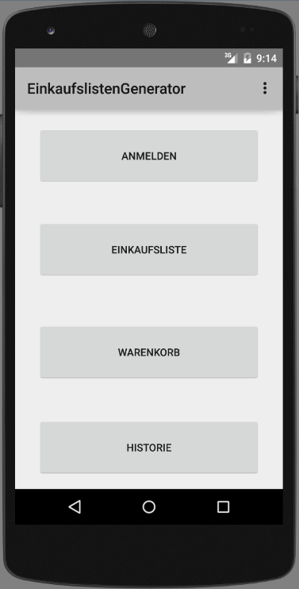

Abbildung 1: Startmaske

In Abbildung 1 ist die Startmaske zu sehen, die beim Öffnen der App angezeigt wird. Bevor die App die Maske erzeugt, mit all ihren Oberflächenkomponenten, baut sie eine Verbindung zu einer MySQL Datenbank auf. Grund dafür ist, dass erst alle relevanten benutzerspezifischen Daten, wie Warenkorb, Einkaufsliste und Historie, geladen werden. Um zu verhindern, dass während der Bedienung weniger Datenbankzugriffe getätigt werden. Dadurch steigt die Perfomance der Applikation. Verbindungen zur Datenbank werden nur aufgebaut, um eventuell relevante Updates in der Datenbank durchzuführen, beim neuen Laden einer Maske oder beim Öffnen einer neuen Maske.

Eine weitere Operation die, die App beim Erzeugen der Startmaske ausführt, ist die Berechnung der kumulativen Verbrauchswahrscheinlichkeit der jeweiligen Produkte im Warenkorb. Die Berechnung vorher auszuführen bringt den Vorteil, dass das Öffnen des Warenkorbs und die Anzeige der Maske, die die Verbrauchswahrscheinlichkeit der jeweiligen Produkte darstellt, schnell laufen. Längere Ladezeiten zwischen den Operationen, werden den User voraussichtlich mehr stören als eine längere Ladezeit beim Starten der App.

Um die kumulative Wahrscheinlichkeit zu berechnen, wird bei der Implementierung eine „Math“ Java-Bibliothek benötigt, die Methoden besitzt, die es ermöglichen die Standardabweichung zu berechnen und aus der Standardabweichung und dem Erwartungswert die Verteilungsfunktion zu bilden. Die Verteilungsfunktion wird auf Basis der Verbrauchsdaten und den MHD-Daten der jeweiligen Produkte erzeugt. Die Verbrauchsdaten des jeweiligen Users, sind eine Auflistung von „Verbrauch in Tagen“ Werten, also Werte die sich aus der Differenz vom Verbrauchsdatum und vom Kaufdatum gebildet werden. Die kumulative Wahrscheinlichkeit pro Produkt wird dann, mit Hilfe der erzeugten Verteilungsfunktion und den abgelaufenen Tagen seit dem letzten Einkauf \(Today\(\) – KaufDatum\(\)\) berechnet.

**Vorschau Coding:**

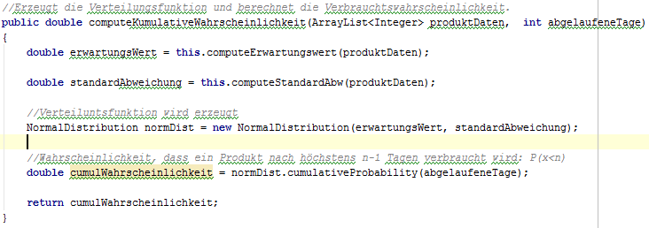

**Warenkorb**

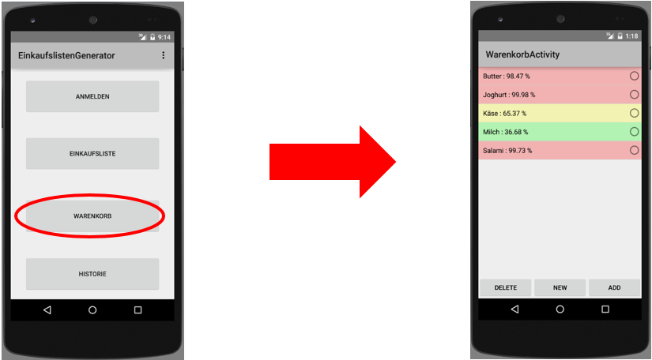

Abbildung 2: Warenkorb                                                                                     ****

Wie in Abbildung 1 zu sehen öffnet sich durch betätigen des „Warenkorb“ Buttons die Warenkorbmaske, die in Abbildung 2 zu sehen ist. Wie man direkt sehen kann sind die jeweiligen Produkte mit ihrer Verbrauchswahrscheinlichkeit und einer Farbe \(rot, grün oder gelb\) markiert. Wie schon erwähnt werden die Wahrscheinlichkeiten schon beim Starten der App berechnet und den Produkten zugewiesen.

In welchen Farben die Produkte markiert werden hängt davon ab, ob die Wahrscheinlichkeiten über und unter festgelegten Schwellwerte liegen:

à Grün steht für x &lt;= 50%

à Gelb steht für 50% &lt; x &lt; 90%

à Rot steht für x &gt;= 90%

Die Farben sollen für den User eine Hilfestellung sein, um besser zu erkennen wie der Bestand seiner Produkte ist. Dafür nutzt die App ein Ampelsystem. Rot soll klar machen das, das jeweilige Produkt mit einer hohen Wahrscheinlichkeit verbraucht ist und auf die Einkaufsliste gesetzt werden sollte. Gelb soll eine kleine Warnung geben das, das Produkt eventuell beim nächsten oder übernächsten Einkauf,  auf die Einkaufsliste gesetzt werden sollte. Die Grüne Markierung kennzeichnet, dass der Bestand mit einer sehr hohen Wahrscheinlichkeit ausreichend ist.

Die App beinhaltet jedoch die Funktion, dass wenn ein Produkt im roten Bereich liegt, es automatisch auf die Einkaufsliste gesetzt wird. Das nimmt dem User die Arbeit ab, die jeweiligen Produkte manuell in die Einkaufsliste zu setzen. Wenn ein Produkt vom Warenkorb auf die Einkaufsliste gesetzt wird, dann wird das als Verbrauchsdatum gewertet und in die Historie bzw. Datenbank aufgenommen.

Der Warenkorb kann natürlich auch manuell bedient werden, indem eines der Produkte über den RadioButton markiert wird und einer der drei Buttons betätigt wird, wie in Abbildung 3 zu sehen:

·         **DELETE BUTTON:** Produkt wird aus dem Warenkorb entfernt

·         **NEW BUTTON:** Ein neues Produkt kann im Warenkorb aufgenommen werden

·         **ADD BUTTON:** Produkt wird in die Einkaufsliste gesetzt, als Verbrauchsdatum aufgenommen und in der Historie eingetragen. Zusätzlich wird noch ein Eintrag in die Verbrauchsstatistik durchgeführt, d.h. die Zeitspanne vom letzten Kaufdatum des Produktes, bis zum aufgenommen Verbrauchsdatum wird eingetragen.

à **Diese Funktion wird von der Amazon Alexa, die den Smart Home Bereich repräsentiert, auch ausgeführt.**

**Einkaufsliste**

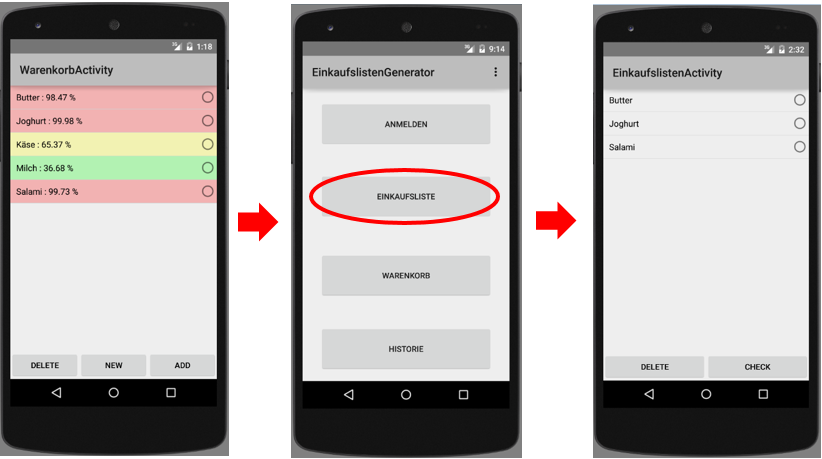

Abbildung 3 Öffnen und Anzeigen Einkaufsliste

Wie in Abbildung 3 sehr gut zu sehen ist, dass Produkte, die rot markiert bzw. die Verbrauchswahrscheinlichkeit über dem Schwellwert von 90% liegt, automatisch auf die Einkaufsliste gesetzt werden \(Siehe Abbildung 4: Butter, Joghurt und Salami\).

Die Einkaufliste kann auch, wie der Warenkorb, manuell bedient werden. Durch markieren eines Produktes, durch den RadioButton, kann das Produkt entweder von der Liste gelöscht oder abgehackt werden. Diese Funktionen sind in den beiden Buttons „DELETE“ und „CHECK“ eingebettet:

·         **DELETE BUTTON:** Markiertes Produkt wird aus der Liste gelöscht, bspw. Weil das Produkt ausversehen auf die Einkaufsliste gesetzt wurde.

·         **CHECK BUTTON:** Das Markierte Produkt wird aus der Liste entfernt und als „Eingekauft“ deklariert, das bedeutet es wird zusätzlich das Kaufdatum aufgenommen und für das ausgewählt Produkt in der Historie aufgenommen

**à Diese Funktion wird vom Smarten Kassensystem beim Bezahlvorgang automatisch übernommen. \(SmartShop\)**

**Kauf- und Verbrauchshistorie**

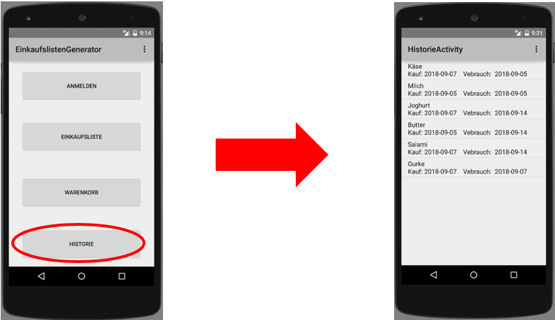

Abbildung 5 Kauf- und Verbrauchshistorie

Eine weitere Funktion die, die App besitzt ist, wie in Abbildung 5 zu sehen, die Anzeige ein Einkaufs-und Verbrauchshistorie. Das heißt, es wird für jedes Produkt sein letztes Kaufdatum und das letzte Verbrauchsdatum angezeigt. Diese Information hilft dem User eine Übersicht zu bekommen über seinen Warenkorb und sie dienen zur Grundlage für die Berechnung des Kauf- und Verbrauchsverhaltens des Users.

**Anmelde - / Registrierungsmaske**

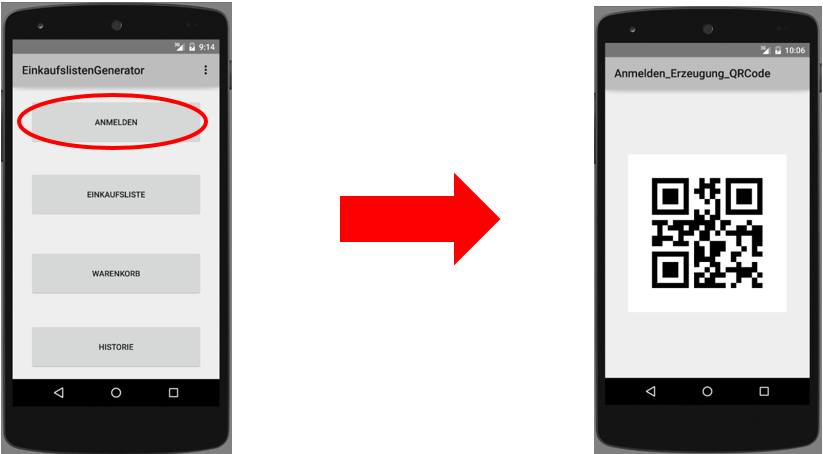

Abbildung 6 Anmelde- / Registrierungsmaske

Durch die in Abbildung 6 zu sehende Funktion der App, ist es möglich sich einen User definierten QR-Code anzeigen zu lassen. Die App erzeugt den QR Code selbst. Dadurch wird es für die User möglich sich bspw. An einem Kassensystem zu registrieren, in dem QR Code ist der Vor – und Nachname enthalten.

Für die Erzeugung eines QR-Codes benötigt die App eine zXing Java-Bibliothek, die importiert werden muss. Diese Bibliothek enthält die wichtigen Klassen „QRCodeWriter“ und „BitMatrix“, die es ermöglichen den gewünschten String zu kodieren und den QRCode in einer Bitmap zu erzeugen, die in einen ImageView eingefügt wird.

**Vorschau Coding**

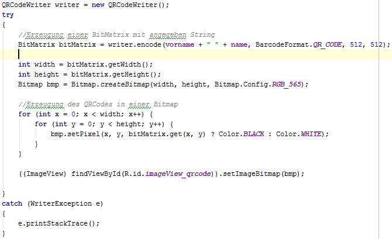

    

## Smart Home Integration via Amazon Alexa

## Smart Shop Integration via smartem Kassensystem

**Betriebssystem:** Android

**Anforderung an das Kassensystem:**

·         Möglichkeit für Kundenanmeldung via QR-Code

·         Anzeige aller Produkte

·         Anzeige aller Produkte die abgescannt oder ausgewählt wurden, in listenform

·         Möglichkeit Produkte via Barcode abzuscannen

·         Nach dem Bezahlvorgang , sollen alle ausgewählten Produkte vom Einkaufzettel gestrichen werden, Produkte die noch nicht im Warenkorb eingetragen sind , sollen eingetragen werden und das Kaufdatum der Produkte soll aufgenommen werden

**Startmaske**

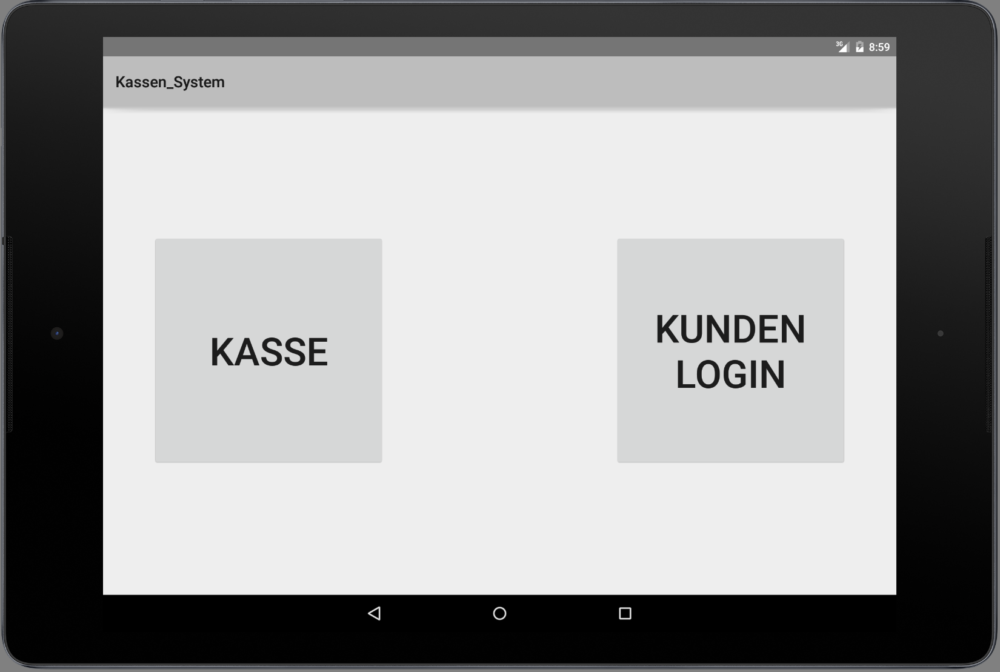

Abbildung 6: Startmaske Kassensystem

In Abbildung 6 ist die Startmaske des Smarten Kassensystems zu sehen. Wie man sieht gibt es zwei Modi. Einmal die Möglichkeit die Kasse direkt zu öffnen ohne Anmeldung des Kunden und die andere Möglichkeit ist es den Kunden sich anmelden zu lassen bevor die Kasse angezeigt wird.

·         **KUNDEN LOGIN Button:** Eine neue Maske öffnet sich und es besteht die Möglichkeit den Kunden via QR-Code, sich anmelden zu lassen. Bevor die Kassenmaske anzeigt wird, wird eine Verbindung zu einer MySQL Datenbank aufgebaut. Es werden alle kundenspezifischen Daten geladen \(Warenkorb\) und alle relevanten Produktdaten.  

à Dies kann in der Doku nicht veranschaulicht werden, da die Abbildungen von einem Android Emulator stammen. Mit diesem ist es nicht möglich ein Kamerabild zu zeigen, somit auch kein QR-Code oder Barcode Scann möglich, da diese über die Kamera gemacht wird.

·         **KASSE Button:** Die Kassenmaske wird geöffnet. Es wird eine Verbindung zu einer MySQL Datenbank aufgebaut und alle relevanten Produktdaten geladen.

**Kasse**

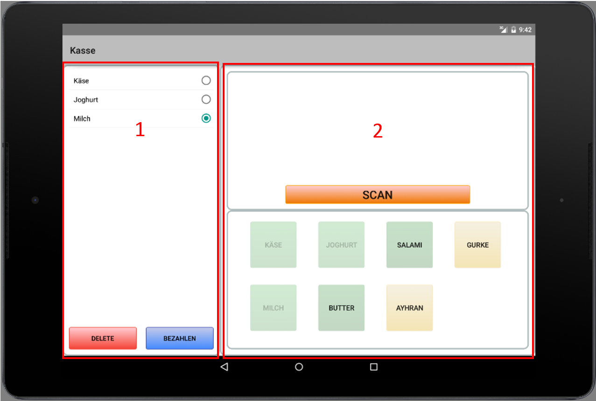

Abbildung 7: Kassenmaske

In Abbildung 7 ist die Kassenmaske zu sehen. Die Maske ist in 2 Fragmente aufgeteilt.

In **Fragment 1** werden die ausgewählten Produkte aufgelistet. Sie werden entweder durch den Barcode Scan oder durch klicken eines Buttons aus Fragment 2, auf die Liste gesetzt.

·         **DELETE BUTTON:** Wenn ein Produkt ausversehen auf die Liste gesetzt wird, kann durch markieren des Produktes mittels des RadioButtons und betätigen des DELETE Buttons, ein Produkt aus der Liste entfernt werden

·         **BEZAHLEN BUTTON:** Die Funktion des Bezahl Buttons ist davon abhängig ob ein Kunde angemeldet ist oder nicht. Wenn kein Kunde angemeldet ist, dann wird nur die Produktliste geleert, der Bezahlvorgang abgeschlossen und die Startmaske anzeigt. Wenn ein Kunde angemeldet ist passiert einiges mehr im Hintergrund. Das Kassensystem baut eine Verbindung zu einer MySQL Datenbank auf, um die Produkte die auf der Liste sind von der Einkaufsliste des Kunden zu streichen, da diese dann als „eingekauft“ gelten. Gleichzeitig wird das Kaufdatum der jeweiligen Produkte in der Historie eingetragen. Zusätzlich werden Produkte die auf der Produktliste sind, jedoch nicht im Warenkorb des Kunden, seinem Warenkorb automatisch hinzugefügt.

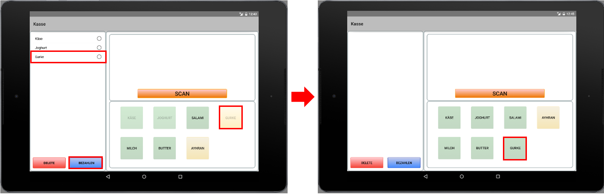

Abbildung 8: Automatisch Produkt in Warenkorb einfügen

à Zum genaueren Verständnis, der Warenkorb beinhaltet die Produkte die der Kunde im Laufe der Zeit mindestens 1-mal eingekauft hat bzw. Produkte die der Kunde generell einkauft.

**Fragment 2**  ist nochmal in zwei Segmente aufgeteilt. Jedes Segment ist eine Möglichkeit ein Produkt auf die Produktliste zu setzen. Zum einen ist es möglich durch klicken des Buttons **SCAN,** der einen Barcode Scanner öffnet, ein Produkt via Barcode auf die Liste zu setzen und zum anderen ist es möglich durch ein Button klick. Für jedes Produkt aus der Datenbank wird dynamisch, bei der Erzeugung der Oberfläche, ein Button generiert. Wird ein Produkt ausgewählt, sei es vom Barcode Scanner oder durch den Button, wird der Button entschärft, sodass Produkte nicht doppelt auf die Liste gesetzt werden \(siehe Abbildung 7, Käse, Joghurt und Milch\).

Die dynamisch erzeugten Buttons werden mit zwei verschiedenen Farben markiert, wie in Abbildung 1 zu sehen. Die grün markierten Buttons bedeuten ein Kunde ist angemeldet und das diese Produkte sich im Warenkorb des Kunden befinden. Die gelb markierten Buttons bedeuten, wenn ein Kunde angemeldet ist, dass diese Produkte nicht im Warenkorb eingetragen sind. Wenn kein Kunde angemeldet ist, sind logischerweise alle Buttons gelb. \(siehe Abbildung 9\)

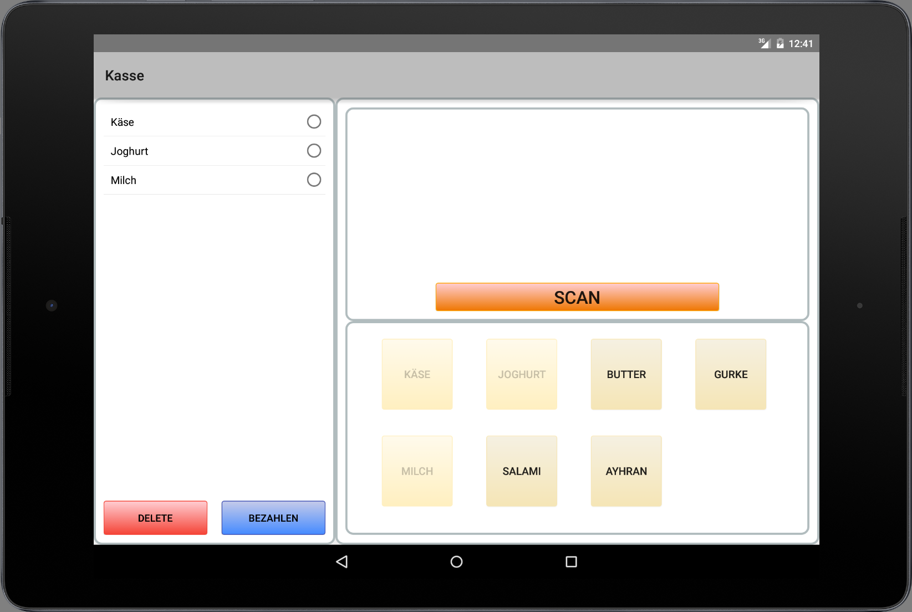

Abbildung 9: Ansicht des Kassensystems, wenn kein Kunde angemeldet ist

