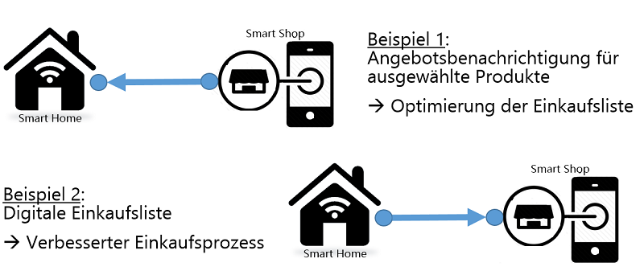
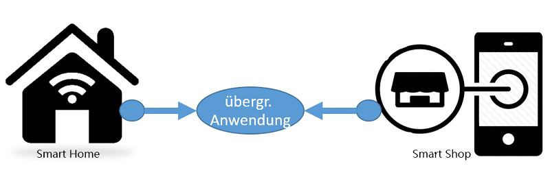
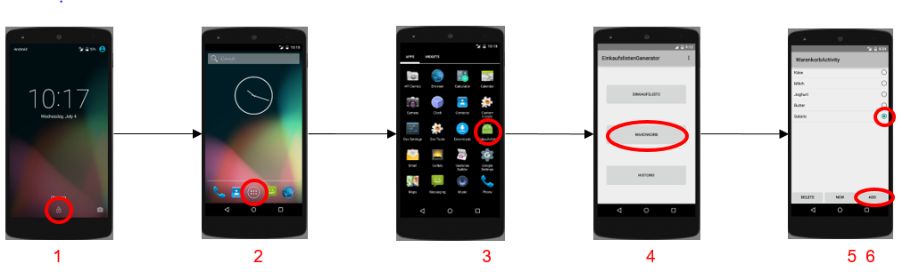
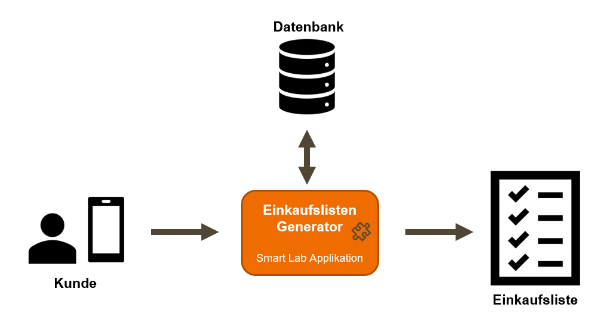

# Vorgehen

## Marktanalyse

Smart Shop bzw. Smart Home stellt den Einsatz von technischen Systemen, automatisierten Verfahren und vernetzten, ferngesteuerten Geräten in Einkaufsläden bzw. Wohnräumen und Häusern dar. Die Funktionen dienen hauptsächlich dazu, die Lebensqualität in irgendeiner Form zu erhöhen. Die Kommunikation und Steuerung der Smart Home und Smart Shop Technik erfolgt dabei über gängige Funkstandards wie WLAN, Bluetooth, ZigBee oder Z-Wave. Die zentrale Steuerungseinheit wird auch als Hub oder Gateway bezeichnet. Geräte starten, steuern und überwachen selbstständig je nach Szenario und Programmierung bestimmte Abläufe im Haushalt sowie in Supermärkten. Interoperabilität ist dabei das Zauberwort.   
Denn bspw. schält sich die Heizung nur aus, wenn das Fenster geöffnet wird. Ist keine Interoperabilität zwischen den Elementen gegeben, ist das Home bzw. der Shop schlichtweg nicht smart. 

Auf dem Markt existiert eine Vielzahl an Herstellern, die IOT-Devices für die unterschiedlichsten Bereiche wie z.B. Smart Home oder Smart Shop anbieten. Aktuelle 'Big Player' im Smart Home Bereich sind bspw. Amazon, Bosch und Google.   
In der folgenden Tabelle sind einige Geräte beispielhaft aufgeführt:

<table>
  <thead>
    <tr>
      <th style="text-align:left">Smart Home Geräte</th>
    </tr>
  </thead>
  <tbody>
    <tr>
      <td style="text-align:left">
        <ul>
          <li>Sprachassistenten</li>
          <li>Lichtsysteme</li>
          <li>Thermostate</li>
          <li>Sicherheitssysteme, wie z.B.:
            <ul>
              <li>Überwachungskameras</li>
              <li>Rauchmelder</li>
              <li>Schließsysteme</li>
              <li>Warn- und Signalgeräte</li>
            </ul>
          </li>
        </ul>
      </td>
    </tr>
  </tbody>
</table>Im Vergleich zum Smart Home Bereich enthält der Smart Shop Bereich bisher eine viel kleinere Produktpalette. Ein paar wenige beispielhafte Geräte die in der heutigen Zeit bereits eingesetzt werden, sind in der folgenden Tabelle dargestellt:

<table>
  <thead>
    <tr>
      <th style="text-align:left">Smart Shop Geräte</th>
    </tr>
  </thead>
  <tbody>
    <tr>
      <td style="text-align:left">
        <ul>
          <li>Smart Screens</li>
          <li>digitale Preisschilder</li>
          <li>smarte Kassensysteme</li>
        </ul>
      </td>
    </tr>
  </tbody>
</table>### Technologien und Standards

Als Teil eines IoT-Ökosystems sind Machine-to-Machine \(M2M\) Dienste einer der wichtigsten Bereiche, in denen die Automatisierung von Geschäftsprozessen stattfindet. Um die Kommunikation zwischen den Maschinen zu ermöglichen, wurde eine breite Palette von Technologien entwickelt, um verschiedensten Anforderungen wie Energieverwaltung, Geschwindigkeit, Komplexität usw. gerecht zu werden.  
Die folgende Klassifizierung zeigt, welche Protokolle für die Infrastruktur, Identifikation, Kommunikation und Transport, für den Datentransfer sowie für Device Management und Semantic verwendet werden können.

| Layer | Protokolle |
| :--- | :--- |
| **Infrastruktur** | 6LowPAN, IPv4/IPv6, RPL |
| **Identifikation** | EPC, uCode, IPv6, URIs |
| **Kommunikation und Transport** | Wifi, Bluetooth, LPWAN, ZigBee, Z-Wave, Smart Beacons |
| **Datenübertragung** | MQTT, CoAP, AMQP, Websocket, Node, REST |
| **Geräteverwaltung** | TR-069, OMA-DM |
| **Semantik** | JSON-LD, Web Thing Model |

Die größte Unsicherheit der potentiellen Kunden von IOT-Geräten besteht oftmals in der Inkompatibilität von Geräten der unterschiedlichen Hersteller. Die Inkompatibilität ist auf Transport-Ebene den unterschiedlichsten Protokollen zu finden. Hier konkurrieren Funkprotokolle wie bspw. Zigbee, Z-Wave, Wifi, Bluetooth, EnOcean, uvm. miteinander. Zusätzlich stehen die vereinzelt eingesetzten kabelgebundenen Systeme wie Powerline-basierte Lösungen in Konkurrenz. Dieser Protokoll-„Wirrwarr“ macht es für den Endkunden wirklich schwierig für seinen Bereich und den eigenen Wünschen eine entsprechend optimierte Lösung zu finden, da der Großteil der Systeme schlichtweg nicht miteinander kompatibel sind.

IOT-Hersteller bemühen sich jedoch nicht um einen einheitlichen Standard, sondern entwickeln meist proprietäre Protokolle und Standards. Dies hat dazu geführt, dass es unzählige ‚Standards‘ und Protokolle im Smart Home Bereich gibt.  Durch die vielen oftmals auch ‚kleinen‘ Anbieter hat sich der Trend entwickelt, dass für jedes smarte Gerät auch eine entsprechende Bridge erworben werden muss, um das bzw. die Geräte ansteuern zu können. D.h. werden in einem Haushalt Produkte von einem verschiedenen Hersteller verwendet, müssen i.d.R. auch entsprechend viele Bridges erworben werden.  
Eine einheitliche Steuerung der Geräte ist oftmals überhaupt nicht möglich, da sich die Plattformen welche zur Steuerung verwendet werden in ihren Protokollstandards ebenfalls unterscheiden können. Um dieses Problem zu beheben gibt es verschiedene Möglichkeiten:

1. Schaffung eines einheitlichen Standards  \(auf Transportebene – d.h. einheitliches Netzwerkprotokoll, Pairing, Bereitstellung von Services, …\)
2. Verwendung einer Integrationsplattform  \(Vereinigung der verschiedenen Standards durch entsprechende Adapter – Übersetzung der verschiedenen Protokolle in 'einheitliche Sprache‘.\)
3. Eine Kombination aus 1\) und 2\)

### Touchpoints zwischen Smart Home und Smart Shop

 Die Verknüpfung von Smart Home und Smart Shop ist nicht trivial, da die beiden Bereiche i.d.R. nichts miteinander zu tun haben. Mit Verknüfung ist gemeint, die beiden Bereiche in irgendeiner Art zusammenzuführen, bzw. durch die Ergänzung des einen durch den anderen einen Mehrwert zu erzeugen.

**Definition übergreifende und ergänzende Anwendung**

Werden Smart Home und Smart Shop in einer Anwendung vereint, das heißt dass beide Bereiche für eine bestimmt Anwendung dienen, kann zwischen übergreifenden und ergänzenden Anwendungen unterschieden werden. **Übergreifende Anwendungen** entsprechen dabei Anwendungen, welche sich an Services aus zwei bzw. in unserem Fall beiden Bereichen, also Smart Home und Smart Shop, bedienen \(wie in _Abbildung 2.2_ zu sehen\).  **Ergänzende Anwendungen** sind Anwendungen, welche durch eine andere Anwendung an Funktionen erweitert bzw. ergänzt werden, dabei der Informationsfluss jedoch nur in eine Richtung fließt.

Ein Beispiel für eine übergreifende Anwendung: Inventarmanagement im Home sowie im Shop-Bereich, d.h. Verknüpfung der Informationen zur Bereitstellung von übergreifenden Services, wie z.B.:

* eine App-Angebotsbenachrichtigung  für einen definierten Produktbestand des Smart Home‘s
* Benachrichtigung des Smart Shops über Kaufprognosen anhand der Informationen des Smart Home‘s

_Abbildung 2.1_ stellt die Beziehung zwischen Smart Home und Smart Shop im Kontext einer ergänzenden Anwendung dar. Dabei ergänzt in Beispiel 1 der Smart Shop das Smart Home, indem Angebotsbenachichtigungen für ausgewählte Produkte an den Kunden in sein Eigenheim gesendet werden. In Beispiel 2 ergänzt das Smart Home den Smart Shop, indem die im Smart Home angelegte Einkaufsliste im Shop abgerufen werden kann. 

Diese grundlegende Unterscheidung zwischen einer übergreifenden und einer ergänzenden Anwendung wurde benötigt, um uns von vorhandenen Anwendungen und Techniken abgrenzen zu können. Übergreifende Anwendungen sind nämlich noch nicht, bzw. zumindest nicht in der breiten Masse vorhanden. Ergänzende Anwendungen hingegen sind bereits einige zu finden.

## Entwurf

Idee war es, eine übergreifende Anwendung zu implementieren, die den Einkaufsprozess und das Inventarmanagement sowohl für Haushalte als auch für Retail vereinfacht bzw. unterstützt. 

**Anwendung:** Intelligente digitale Einkaufslisten-Applikation mit folgenden Funktionen:

* dynamische Anpassung der Einkaufsliste
* \(Teil-\)automatisiertes Befüllen der Einkaufsliste
* Kategorisierung der Produkte nach Dringlichkeit

Diese Funktionen werden anhand folgender Informationen realisiert:

* Verbrauchs- und Kaufverhalten des Users
* Statistische Haltbarkeitsdaten

Im Folgenden werden die für eine Implementierung auftretenden Fragen beantwortet. 

### Wie wird die Wahrscheinlichkeit ob ein Produkt benötigt wird basierend auf Verbrauchs- und Haltbarkeitsdaten bestimmt?

Um eine automatisierte Verwaltung der Einkaufsliste zu ermöglichen, muss die Wahrscheinlichkeit bestimmt werden können, ob ein bestimmtes Produkt bereits verbraucht ist oder nicht. Dies kann auf verschiedenste Art und weise realisiert werden. 

Abbildung XY 

* Smart Home: Erfassung von Verbrauchsdaten über Smart Home Geräte \(Alexa\).
* Smart Shop: Erfassung von Ablaufdaten von Produkten / Produktgruppen und Lieferung von Einkaufsdaten eines Verbrauchers über Smart-Shop-Geräte.
* Einkaufsliste Applikation: Zusammenführung von Ablauf- und Verbrauchsdaten mit dem Einkauf und Bestimmung der Wahrscheinlichkeiten der Produktnachfrage und Verwendung von Wahrscheinlichkeiten zum automatischen Füllen der Einkaufsliste nach definierten Regeln.

#### Methods:

Die dargestellten Wahrscheinlichkeitsfunktionen sind nur ein kleiner Teil aller vorhandenen Funktionen.

  
Um zu überprüfen, ob eine allgemeine Wahrscheinlichkeitsfunktion \(Dichte\) der gegebenen Datenverteilung ähnlich ist, gibt es verschiedene Möglichkeiten.Diese können z.B. sein:

* Optische Prüfung \(Vergleich beider Funktionen optisch\)
* Kolmogorow-Smirnow-Test
* Anderson-Darling-Test
* Chi-Quadrat-Test

#### Beispiel: Normalwahrscheinlichkeitsverteilung:

Angenommen, wir haben festgestellt, dass unsere Daten \(fast\) normalverteilt sind. Nun können wir die entsprechende Wahrscheinlichkeitsdichtefunktion für unsere Daten berechnen.

* Wahrscheinlichkeitsdichtefunktion f \(einer Variablen x\) \[Normalverteilung\]:

* Erwarteter Wert E \(einer Variablen X\):

* Abweichung σ² und Standardabweichung σ \(einer Variablen X\):

#### Kumulative Wahrscheinlichkeitsverteilungsfunktion:

Nachdem wir eine Wahrscheinlichkeitsfunktion \(Dichte\) aufgebaut haben, müssen wir die Funktion in eine kumulative Wahrscheinlichkeitsfunktion umwandeln. Mit dieser Funktion kann dann bestimmt werden, bis wann ein Produkt wieder gekauft werden muss. Dies kann mit Hilfe der folgenden Formel erfolgen: kumulative Wahrscheinlichkeitsverteilungsfunktion P\(X ≤ x\):

Ablaufdaten als Datenbasis:

In diesem Fall hängt die Wahrscheinlichkeit, dass ein Produkt gekauft werden muss, nur von den Ablaufdaten des Produkts ab. Basierend auf einem Satz von Ablaufdaten eines Produkts ist es möglich, zu bestimmen, mit welcher Wahrscheinlichkeit ein Produkt zu einem bestimmten Zeitpunkt abläuft, indem die Wahrscheinlichkeitsfunktion \(Dichte\) oder die kumulative Wahrscheinlichkeitsfunktion aufgebaut wird. Das heißt, je mehr Daten verfügbar sind, desto genauer kann die Wahrscheinlichkeit bestimmt werden.Informationen, die von:

* Manuelle Erfassung
* Smart Shop
  * Große Menge an Ablaufdaten verfügbar
  * Langzeitstatistik denkbar
* Smart Home
  * Smart Home Geräte können das Datum verfolgen

Beispiel für Ablaufdaten:

Angesichts der folgenden Ablaufdaten für ein bestimmtes Produkt: 01.07.2018, 15.07.2018, 01.07.2018, 01.07.2018, 15.07.2018. Zur einfacheren Berechnung übertragen wir diese Daten in, Tage bis   Ablaufdatum:  1 Tag, 15 Tage, 1 Tag, 1 Tag, 15 Tage \(angenommen heute ist 30.06.2017\):

* Stark verbreitet
* Keine Übereinstimmung der allgemeinen Wahrscheinlichkeitsverteilung \(Näherung nicht sinnvoll\)
* Verwendung der relativen Häufigkeit der Daten zur Erzeugung einer Wahrscheinlichkeitsfunktion

So beschlossen wir nun, die kumulative Wahrscheinlichkeitsverteilung basierend auf den Daten \(und ihrer relativen Häufigkeit\) aufzubauen. Für das angegebene Beispiel würde die Funktion so aussehen:

Verbrauchsdaten als Datenbasis:

In diesem fall hängt die Wahrscheinlichkeit, dass ein Produkt gekauft werden muss, nur vom Verhalten des Verbrauchers ab. Dieses Verhalten wird in Form von Verbrauchsdaten geliefert. Das heißt, die Daten enthalten Informationen darüber, wie lange es dauert, bis ein Produkt von einem bestimmten Verbraucher/Haushalt konsumiert wird. Basierend auf einem Satz von Verbrauchsdaten eines Produkts ist es möglich, zu bestimmen, mit welcher Wahrscheinlichkeit ein Produkt bis zu einem bestimmten Datum verbraucht wird, indem die Wahrscheinlichkeitsfunktion \(Dichte\) oder die kumulative Wahrscheinlichkeitsfunktion aufgebaut wird. Wie bereits erwähnt, bedeutet dies, dass je mehr Daten verfügbar sind, desto genauer kann die Wahrscheinlichkeit bestimmt werden. 

Zum Beispiel: Angesichts der folgenden Verbrauchsdaten für ein bestimmtes Produkt: 2,3,4,4,4,4,5,5,5,5,6,5,6,6,6,6,7,7,8 \(Tage\)

  
In der Abbildung sehen wir, wie die Daten verteilt sind. Wie wir sehen können, sieht die Verteilung der Daten ähnlich aus eine normale Verteilung.Deshalb werden wir eine Approximation der Wahrscheinlichkeitsfunktion unter Verwendung der Normalverteilungsfunktion erstellen.

Wir haben uns entschieden, die Wahrscheinlichkeitsfunktion oder die kumulative Wahrscheinlichkeitsfunktion aufzubauen, indem wir sie mit Hilfe der Normalverteilungsfunktion approximieren. Um die Wahrscheinlichkeitsdichtefunktion zu erhalten, müssen wir zunächst den Erwartungswert und die Standardabweichung/varianz bestimmen:

Nachdem wir die Wahrscheinlichkeitsdichtefunktion erstellt haben, können wir darüber integrieren, um die kumulative Wahrscheinlichkeitsverteilungsfunktion zu erhalten.Die Wahrscheinlichkeitsdichtefunktion kann uns die Wahrscheinlichkeit mitteilen, dass ein Produkt genau jetzt verbraucht wird. Für unseren Anwendungsfall wird also die kumulative Wahrscheinlichkeitsverteilungsfunktion benötigt, weil wir nicht die Wahrscheinlichkeit wissen wollen, dass ein Produkt genau jetzt konsumiert wird, sondern wir wollen jetzt wissen, wie die Wahrscheinlichkeit ist, dass es bisher konsumiert wird.

### Welchen Mehrwert liefert Smart Shop?

In einer Welt mit sofortigem Zugriff auf Informationen, wo der Wettbewerb nur einen Klick entfernt ist, die Gewinnung und Bindung von Kunden ist von entscheidender Bedeutung für die Überleben Mobile Technologien können helfen, das Ziel zu erreichen. diese Ziele durch die Verbesserung der Einkaufsmöglichkeiten zu erreichen. Erfahrung und Informationsbeschaffung und Intimität mit den Kunden. Dies wird den Einzelhändlern neue Möglichkeiten eröffnen und Hersteller, mit denen sie sich stärker befassen sollten.

#### Idee : Erstellung  intelligentes Kassensystem:

wir haben uns entschieden ein intelligentes Kassensystem zu erstellen mit folgenden Anforderungen:

* Möglichkeit für Kundenanmeldung via QR-Code
* Anzeige aller Produkte
* Anzeige aller Produkte die abgescannt oder ausgewählt wurden
* Möglichkeit Produkte via Barcode abzuscannen
* Nach dem Bezahlvorgang :

  * Sollen alle ausgewählten Produkte vom Einkaufzettel gestrichen werden
  * Produkte die noch nicht im Warenkorb eingetragen sind , sollen eingetragen werden
  * Das Kaufdatum der Produkte soll aufgenommen werden

### Welchen Mehrwert liefert Smart Home?

Bevor wir uns darauf konzentrieren, wie Smart Home unsere Einkaufsprozesse optimieren kann, geben wir einen kurzen Überblick darüber und über seine Möglichkeiten. Der Smart-Home-Markt ist einer der am schnellsten wachsenden Märkte der Welt. Smart-Home-Geräte sind bereits in fast jedem Aspekt des Wohnens integriert, zum Beispiel: Unterhaltung, Sicherheit, Hauswirtschaft, Überwachung usw.Diese Geräte verbessern die Prozesse, indem sie zusätzliche Dienste bereitstellen oder den Aufwand für bestimmte Aufgaben reduzieren. Diese schnelle Entwicklung wird durch eine schnelle Verbesserung von Software und Hardware ermöglicht.

Viele Prozesse können mithilfe von Smart Home verbessert werden. In diesem Abschnitt konzentrieren wir uns jedoch auf die Verbesserung des Einkaufsprozesses.

* Der User benötigt  5 oder 6 Clicks auf seinem Smartphone, um ein Produkt auf die digitale Einkaufsliste zu setzen
* Zuvor besteht die Möglichkeit , dass der User das Smartphone, in dem Moment, in der er ein Produkt auf die Einkaufsliste setzen will, nicht zu Hand hat. Er muss es erst suchen.
* Das bedeutet von dem Wunsch, ein Produkt auf die Einkaufsliste zu setzen und bis das Produkt auf der digitalen Einkaufsliste ist, müssen viele Steps durchlaufen werden. Vielen Usern ist das ein zu großer Aufwand und werden deshalb die Software nicht nutzen


 Lösung: Smart Home Devices sind die Lösung um diesen Vorgang zu vereinfachen und zu beschleunigen.Wir haben die Technologien im Smart Home Bereich analysiert und bewertet welche für den Bestands und Kontrollprozess hilfreich sind:

Amazon Alexa:

* Verwaltet eine digital Shopping List mit Sprachsteuerung
* Dadurch entfällt die manuelle Verwaltung : Mit der Sprachsteuerung beispielsweise kann ein Produkt mit nur einem Befehl auf die Einkaufsliste gesetzt werden, anstatt zuerst das Smartphone auszupacken, die Einkaufslisten-App zu öffnen und das richtige Produkt hinzuzufügen
* Aufnahme des Verbrauchsdatum beim Hinzufügen eines Produktes auf die Einkaufliste
* Aufnahme „Verbrauch in Tagen“ eines Produktes und hinzufügen in die Verbrauchsstatistik  

Smarter Kühlschrank:

* Anzeige des tatsächlichen Bestands im Kühlschrank
* Automatisches hinzufügen von Produkten auf eine digitale Einkaufsliste wenn Produkt ausgeht.

Wir haben uns für voice- vontrol bei der Realisierung entschieden weil der Smart-Fridge von der Technologie noch nicht so ausgereift ist bzw. wenn noch zu teuer und selbst entwickelte Apps können nicht bestückt werden.

### Fusion von Smart Home und Smart Shop:

Im Artikel "Towards a definition of the Internet of Things \(IoT\)" von IEEE Internet of Thing gibt es viele Definitionen dieses Ausdrucks aus verschiedenen Gruppen. IoT-SRA \(Internet of Things Strategic Research Agenda\) bietet eine Definition des IoT, die auf drei Perspektiven basiert. IoT muss sein Dinge orientiert, was bedeutet, dass die Dinge Identitäten haben, um in einem intelligenten Raum zu funktionieren und Schnittstellen zur Kommunikation mit der Umgebung zu verwenden. Internetorientiert, d.h. Existenz einer globalen Netzwerkinfrastruktur zur Verknüpfung von physischen und virtuellen Objekten mit Hilfe von Daten- und Kommunikationsmöglichkeiten. Semantisch orientiert, d.h. IoT-Ressourcen, Informationsmodelle, Datenanbieter und Verbraucher müssen interoperabel sein.

#### Architektur:

#### Architektur: Stufe 1

  

In dieser Architekturebene muss der Benutzer seinen Standard-Einkaufswagen in der App manuell eingeben. Mindesthaltbarkeitsdaten werden auch manuell aus verschiedenen Geschäften gesammelt und in einer Datenbank gespeichert.Die Komponente "Einkaufslistengenerator" ermittelt anhand dieser Daten, welches Produkt auf der Einkaufsliste stehen soll.

#### Architektur: Stufe 2

  

Diese Ebene zeigt ein Architekturbeispiel einer ergänzenden Anwendung. Sobald die Zahlung abgeschlossen ist, bietet der Smart Shop-Bereich  verbraucherspezifische Daten über gekaufte Produkte. Diese Daten werden über die Komponente "Einkaufslisten-Generator"  verwendet, um eine verbraucherspezifische Standard-Einkaufskarte und -Verbrauch zu erzeugen, was zur Optimierung der Einkaufslistengenerierung beiträgt.

#### Architektur: Stufe 3

  

Diese Ebene zeigt ein Architekturbeispiel einer übergreifenden Anwendung.Smart Home liefert die zusätzlichen Echtzeitverbrauchsdaten des Verbrauchers.Die beiden Bereiche Smart Home und Smart Shop liefern Eingabedaten zur Optimierung der Einkaufsliste.

  

 

  

  

  

 

